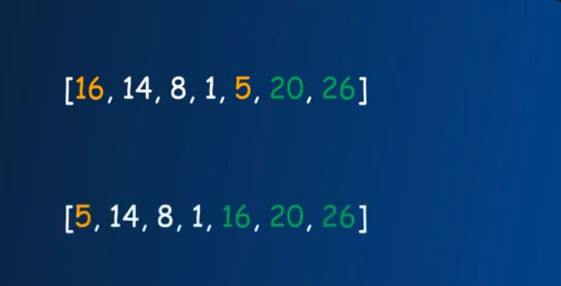

# Пирамидальная сортировка и сортировка слиянием
## Пирамидальная сортировка
### Работа алгоритма
Основная идея пирамидальной сортировки заключается в построении двоичной кучи и последующем извлечении из нее наибольшего элемента. Двоичная куча — это законченное двоичное дерево, в котором элементы хранятся в особом порядке: значение в родительском узле больше (или меньше) значений в его двух дочерних узлах. Первый вариант называется max-heap, а второй — min-heap. Куча может быть представлена двоичным деревом или массивом.

Алгоритм пирамидальной сортировки выполняется в несколько этапов:
1. Постройте max-heap из входных данных.
2. На данном этапе самый большой элемент хранится в корне кучи. Замените его на последний элемент кучи, а затем уменьшите ее размер на 1. Наконец, преобразуйте полученное дерево в max-heap с новым корнем.
3. Повторяйте вышеуказанные шаги, пока размер кучи больше 1.

**составим двоичное дерево:**


**рассмотрим узел 8. Тк 26 > 8 > 1, то меняем 8 и 26 местами:**


**рассмотрим на узел 16. Тк 20 > 16 > 14, то меняем 16 и 20 местами:**


**рассмотрим корневой узел. Тк 26 > 20 > 5, то меняем 5 и 26 местами:**


**сравниваем 5 и 8, меняем местами:**


**после выполнения предыдущих действий у нас получился следующий массив, он не является отсортированным. Но из-за действий, которые мы выполняли ранее у нас получилось (и в любом случае получится) так, что самое большое число оказалось на 1 месте. Переносим его в конец и фиксируем:**


**продолжаем опускать корень по дереву. Тк 5 < 20, то меняем местами:**


**смотрим узем 5, тк 5 < 16, то меняем:**


**меняем местами первый элемент списка и последний, фикструем:**


**смотрим корень. Тк 16 > 8 > 1, то меняем меставми 16 и 1:**


**то тем же условиям меняем местами 14 и 1:**


**меняем местами первый и последнй элемент несортированного списка, фиксируем:**



**меняем местами 5 и 14:**


**меняем местами 1 и 5:**


**меяем местами первый и последний элемент несортированного списка, фтксируем:**


**меняем местами 5 и 8:**


**меняем местами первый и последний элемент несортированной части, фиксируем:**


**оставшиеся 1 и 5 в двоичном дереве уже находятся на своих местах, => меняем местами первый и последний элемент несортированной части:**


**в результате получаем отсортированный саисок:**


- Эффективность: пирамидальная сортировка обладает асимптотической сложностью O(n log n), что делает ее быстрой и эффективной для сортировки больших объемов данных.
- Универсальность: пирамидальная сортировка может быть применена к различным типам данных и структурам, что делает ее универсальным алгоритмом сортировки.

### Реализация пирамидальной сортировки на Python
```python
# Процедура для преобразования в двоичную кучу поддерева с корневым узлом i, что является индексом в arr[]. n - размер кучи
def heapify(arr, n, i):
    largest = i # Инициализируйте наибольший размер как корень
    l = 2 * i + 1   # left = 2*i + 1
    r = 2 * i + 2   # right = 2*i + 2

  # Проверяем существует ли левый дочерний элемент больший, чем корень
    if l < n and arr[i] < arr[l]:
        largest = l

    # Проверяем существует ли правый дочерний элемент больший, чем корень
    if r < n and arr[largest] < arr[r]:
        largest = r

    # Заменяем корень, если нужно
    if largest != i:
        arr[i],arr[largest] = arr[largest],arr[i] # свап

        # Применяем heapify к корню.
        heapify(arr, n, largest)

# Основная функция для сортировки массива заданного размера
def heapSort(arr):
    lenth = len(arr)

    # Построение max-heap.
    for i in range(lenth, -1, -1):
        heapify(arr, lenth, i)

    # Один за другим извлекаем элементы
    for i in range(lenth-1, 0, -1):
        arr[i], arr[0] = arr[0], arr[i] # свап 
        heapify(arr, i, 0)

# Управляющий код для тестирования
arr = [5, 16, 8, 14, 20, 1, 26]
print(f'Начальный список: {arr}')
heapSort(arr)
print(f'Отсортированный список: {arr}')
```

## Сортировка слиянием
### Работа алгоритма
Сортировка слиянием — это алгоритм сортировки, который использует подход "разделяй и властвуй" для сортировки элементов в списке. Основная идея заключается в том, чтобы разбить список на более мелкие списки, сортировать эти мелкие списки (если они достаточно малы, то их легко сортировать), а затем объединять их в один отсортированный список. Этот процесс повторяется рекурсивно, пока весь список не будет отсортирован. Сортировка слиянием эффективна для больших наборов данных и имеет временную сложность O(n log n) в среднем и худшем случае, что делает её одной из самых эффективных методик сортировки.

Принцип работы сортировки слиянием можно описать следующим образом:
1. Разделение: Разделить неотсортированный список на две примерно равные части.
2. Властвование: Рекурсивно сортировать обе половины списка. Если подсписок содержит один или ноль элементов, он уже отсортирован.
3. Слияние: Объединить два отсортированных подсписка в один отсортированный список.

### Реализация пирамидальной сортировки на Python
```python
def merge_sort(arr):
    if len(arr) > 1:
        mid = len(arr) // 2  # Находим середину списка
        left_half = arr[:mid]  # Делаем срез для левой половины
        right_half = arr[mid:]  # Делаем срез для правой половины

        # Рекурсивно сортируем обе половины
        merge_sort(left_half)
        merge_sort(right_half)

        # Индексы для итерации по двум половинам и основному списку
        i = j = k = 0

        # Слияние двух половин
        while i < len(left_half) and j < len(right_half):
            if left_half[i] < right_half[j]:
                arr[k] = left_half[i]
                i += 1
            else:
                arr[k] = right_half[j]
                j += 1
            k += 1

        # Копирование оставшихся элементов левой половины, если они есть
        while i < len(left_half):
            arr[k] = left_half[i]
            i += 1
            k += 1

        # Копирование оставшихся элементов правой половины, если они есть
        while j < len(right_half):
            arr[k] = right_half[j]
            j += 1
            k += 1

# Пример использования
arr = [12, 11, 13, 5, 6, 7]
print("Исходный массив:", arr)
merge_sort(arr)
print("Отсортированный массив:", arr)
```